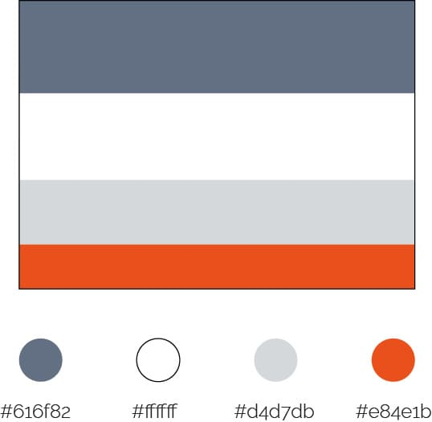
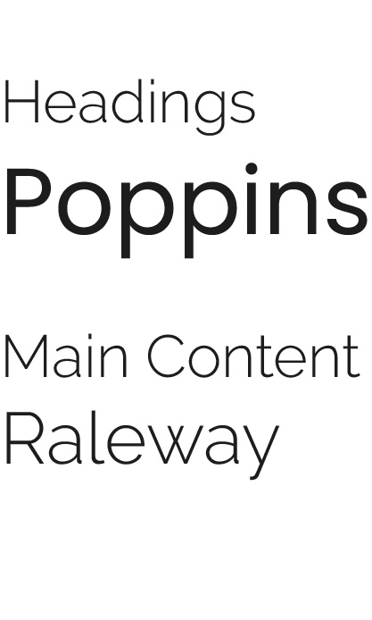

### Project 3

# SizeMeApp Website 

[View project on Heroku](#) 

## Introduction 

This website serves as the front-facing platform for SizeMeApp, an innovative solution designed to simplify online shopping by helping users find their perfect fit. While this is not the actual application, the website provides key information about how SizeMeApp works, its benefits for both customers and retailers, and how it integrates with e-commerce platforms. 

Explore the site to learn more about how SizeMeApp reduces returns, improves customer satisfaction, and enhances the online shopping experience through smart size recommendations. 

# CONTENT

[DATABASE OVERVIEW](#repository-&-database-overview)
- Database ERD Scheme

[USER EXPERIENCE (UX)](#user-experience)
- The website across UX planes
- User Stories
- Accessibility
- Aria labels

[DESIGN PLANNING](#design-planning)
- Design Planning
- Kanban Board

[VISUAL DESIGN IDENTITY](#visual-design-identity)
- Colour Scheme
- Typography
- Imagery
- Wire Frames
- Features

[TECHNOLOGIES USED](#technologies-used)
- Languages used to create the website
- Frameworks & Libraries
- Software
- Automated Tools
- ChatGPT

[DEPLOYMENT](#deployment)
- Heroku

[TESTING](#testing)
- Manual vs. Automated Testing
- Manual Testing
- Devices
- Browsers
- User Story Testing
- Testing Grid
- Automated Testing
- Chrome Dev Tools
- Lighthouse
- Validators
- Testing with Django
- Bugs & Fixes

[REFERENCES](#references)
- Media References
- Content References

[CREDITS](#credits)
- Images
- Code

[PERSONAL NOTES](#personal-notes)

[ACKNOWLEDGMENTS](#acknowledgments)

 
 

# DATABASE OVERVIEW

The database schema for SizeMeApp is designed to efficiently manage user data, blog content, and user interactions. It consists of six main tables:

- CustomUser – Stores user details, including authentication and profile information.
- Post – Represents blog posts, which can only be created by admin users.
- Comment – Allows all users to comment on blog posts.
- LikePost – Manages the many-to-many relationship between users and posts, tracking likes.
- Newsletter – Handles newsletter content
- Subscriber – Handles email subscriptions.

The schema ensures clear relationships between users and content while maintaining scalability for future enhancements.

[Back to Content Table](#content)

- # USER EXPERIENCE
- [UX planes](#the-website-across-UX-planes)
- [User Stories](#user-stories)
- [Accessibility](#accessibility)
- [Aria labels](#aria-labels-used)

## The website across UX planes

### Strategy Plane
The primary goal of the SizeMeApp website is to provide users with clear, accessible information about the app’s functionality while guiding them toward signing up and using the service. The target audience includes online shoppers seeking accurate size recommendations, as well as retailers looking to reduce returns and improve customer satisfaction.

The website meets user needs by:

- Offering a clear explanation of how SizeMeApp works.
- Providing calls-to-action that encourage users to sign up.
- Showcasing business benefits for retailers and e-commerce brands.
- Creating a seamless experience for users to explore the app's features.

### Scope Plane
The website includes essential features to educate and engage users:

- A homepage that introduces SizeMeApp and its benefits.
- A sign-up process that allows users to create an account.
- An interactive “How It Works” page explaining the app’s technology.
- A blog section where users can explore trends in fashion and sizing.
- A contact page for user inquiries and business partnerships.

Additional features, such as testimonials, success stories, and a retailer-focused section, enhance credibility and help potential users and businesses understand the impact of the app. This will be implemented in the future.

### Structure Plane
The website is structured to ensure smooth navigation and user engagement:

- The homepage provides an overview with a strong call to action.
- The "How It Works" page explains the sizing technology in an easy-to-understand format.
- A user dashboard (for registered users) allows them to manage their profile and measurements.
- The blog section offers informative content and allows registered users to engage via comments.

This logical structure ensures that first-time visitors, returning users, and frequent users can easily find relevant content.

### Skeleton Plane
The website layout is designed for clarity and usability:

- Navigation menus provide quick access to key sections.
- Clear CTAs (e.g., "Sign Up," "Try Now") guide users toward important actions.
- A well-structured blog page ensures easy reading and engagement.
- The user dashboard presents stored measurements and recommendations in an intuitive format.
- The contact page offers a simple, accessible form for inquiries.

The layout is responsive, ensuring an optimized experience across desktop, tablet, and mobile devices.

### Surface Plane
The visual design of the SizeMeApp website is clean, modern, and user-friendly, emphasizing trust and functionality:

- A neutral color palette combined with accent colors for CTAs enhances readability and usability.
- Typography is professional and easy to read, reinforcing clarity.
- High-quality visuals (icons, imaged) strengthen user engagement.
- Hover effects improve interactivity without distracting from core content.

Together, these design choices ensure that the website provides an engaging, informative, and intuitive experience for all visitors.

## User Stories

The development of the SizeMeApp website followed a structured user story framework, ensuring that each feature was designed with clear objectives, measurable success, and actionable development steps.

### Example of User Story Implementation

#### User Story:
As a registered user, I want to update my measurements, so that I can keep my size data accurate as my body changes.

#### Acceptance Criteria:
- Users can edit and save new measurements.
- Changes are updated in real time.

#### Tasks:
- Implement an “Edit Measurements” feature.
- Ensure previous data is overwritten securely.
- By following this structured approach for each feature, the website ensures a user-centered experience while maintaining development clarity and efficiency.

The site follows the CRUD (Create, Read, Update, Delete) methodology to manage data efficiently. Each user story is structured to ensure that core functionalities align with CRUD operations, enabling seamless interaction with the system.

The user stories for SizeMeApp are structured into three categories:

- New Visitors – First-time users exploring the site to understand its purpose and decide whether to sign up.

- Returning Users – Registered users who come back to interact with features such as storing measurements and commenting on blog posts.

- Frequent Users – Engaged users who update their data, interact regularly, and receive personalized recommendations.

### New Visitors (First-Time Users Exploring the Site)
New visitors primarily engage with the site through reading and navigating content to understand SizeMeApp and its benefits.

- Visitors want to quickly understand what SizeMeApp does, how it works, and whether it is relevant to them.
- Clear call-to-action buttons guide users to sign up and test the application.
- Information is provided for both individual shoppers and business owners, including benefits for reducing returns.
- Blog posts and comments are accessible to all visitors to learn about online sizing and fashion technology.
- A team page introduces the people behind SizeMeApp to build trust.
- A contact form provides an easy way to ask questions or give feedback.

CRUD implementation: Create (contact form submission), Read (blog posts, team page, testimonials).

### Returning Visitors (Users Coming Back After Initial Engagement)
Returning users have registered and now interact with the site by storing personal data and engaging with content.

- Users can store their personal measurements in their profile for easier access while shopping online.
- They can comment on blog posts to engage in discussions.
- A simple and secure login process allows them to access stored measurements and interact with blog content.
- Users can like blog posts to save their favorite content.

CRUD implementation: Create (measurements, comments, likes), Read (stored data, blog posts), Update (profile details).

### Frequent Visitors (Engaged Users Who Interact Regularly)
Frequent users continue to refine their data and interact with advanced features.

- Users can update their measurements as their body changes to ensure accuracy.
- They remain logged in for convenience, reducing the need to re-enter credentials.
- Based on stored measurements, users receive personalized recommendations.
- Newsletters inform them about new features and updates.

CRUD implementation: Read (recommendations, testimonials), Update (measurements, profile), Read/Delete (notifications).

### Additional CRUD Features for Blog and Measurements
To ensure full CRUD coverage, additional user stories for managing blog posts, comments, and user data are included:

- Admins can create, edit, and delete blog posts to maintain relevant content.
- Registered users can edit or delete their own comments.
- Admins can moderate and delete inappropriate comments.
- Users can delete their account if they choose to remove their data.

CRUD implementation: Create (blog posts, comments, newsletters), Read (blog content, comments, measurements), Update (blog posts, profile), Delete (comments, user accounts).

Full user stories and progress tracking are available on the **SizeMeApp Kanban Board**:  
[View the Kanban Board](https://github.com/users/Sara-Sundin/projects/10/views/1)

## Accessibility
The following measures has been taken to make sure the website is accessible.
- Semantic Elements: Elements like header, main, and footer are used to provide clear structure, making it easier for screen readers to interpret content.
- Descriptive Headings: Properly structured heading levels (e.g., h1, h2, h3) to create a logical document outline.
- Alt Attributes: Every image includes meaningful alt text, ensuring visually impaired users understand the content.
- Focusable Elements: Navigation links, buttons, and forms are fully accessible using only the keyboard (e.g., via tab and enter keys).
- High Contrast: Text and background colors are chosen to meet the standards.
- Flexible Layouts: The website is fully responsive, ensuring accessibility across various devices, including desktops, tablets, and smartphones.
- Viewport Meta Tag: Ensures proper scaling and readability on mobile devices.
- Labels for Form Fields: All form fields include <label> tags or appropriate aria-label attributes to guide users through form completion.
- ARIA labels: Aria roles are added where necessary to define regions of the page for assistive technologies.
- Readable Fonts: Fonts like "Lato" are legible with sufficient size and line spacing for comfortable reading.
- Scalable Text: Text can be resized without loss of content or functionality.
- Accessibility Testing Tools: Lighthouse and Django automated tools has been used to identify and address accessibility issues.

## ARIA Labels
To ensure that the website is fully accessible and user-friendly for individuals using assistive technologies, the following ARIA attributes should be implemented. Some of these labels are already in place, while others need to be added to enhance accessibility further.

### Base Template (all pages)
- aria-controls="navbarNav" (for navbar toggler)
- aria-expanded="false" (for navbar toggler)
- aria-label="Toggle navigation" (for navbar toggler)
- role="img" and aria-label="SizeMeApp Logo" (for logo)
- aria-hidden="true" (for user avatar)
- aria-current="page" (for active navigation links)
- role="contentinfo" (for footer)

### Blog Page
- aria-label="{{ post.title }}" (for the image container)
- aria-live="polite" (for the author name flash message)
- aria-label="Read more about {{ post.title }}" (for the post link)
- aria-label="Page navigation" (for the pagination navigation)
- aria-label="Go to next page" (for the next page link)

### Post Page
- aria-label="{{ post.title }}" (for the featured image)
- aria-label="Close" (for the close button in the delete confirmation modal)
- aria-labelledby="deleteModalLabel" (for the delete confirmation modal)
- aria-hidden="true" (for the delete confirmation modal when not active)

### Dashboard Page
- role="img" for user avatar and measurement guide image.
- aria-label="User avatar" for the profile picture.
- aria-labelledby="avatarModalTitle" for the avatar modal.
- aria-labelledby="chestLabel" (and similar for waist, hips, shoulders) for measurement fields.
- aria-label="Illustration showing how to take body measurements." for the measurement guide image.
- aria-label="Delete measurements" for the delete button.
- aria-expanded="false" on the measurement toggle button (should be dynamically updated).

### Avatar Generator
- aria-label="Select color [color name]" for swatches.
- aria-label="Avatar preview" for the avatar canvas.
- aria-label="Save your avatar" for the download button.
- aria-label="Reset avatar settings" for the reset button.
- aria-label="Go back to main thumbnails" for the back button in additional thumbnails.
- role="img" for the avatar preview.
- aria-expanded="false" for hidden thumbnail sections (should be updated dynamically).

### Home Page
- aria-label="SizeMeApp Logo" (for hero section logo)
- aria-label="Sign up or go to dashboard" (for CTA button)
- aria-label="Enter your email address" (for newsletter email input)
- aria-label="Subscribe to newsletter" (for newsletter subscribe button)
- role="status" (for success message container)
- aria-label="Return to the homepage" (for back to home button)
- aria-label="Learn more about Why SizeMeApp" (for icon buttons linking to about page)
- aria-label="Visit our Instagram page (opens in a new tab)"
- aria-label="Visit our LinkedIn page (opens in a new tab)"
- aria-label="Connect on Whatsapp (opens in a new tab)"

### About Page
- aria-hidden="true" (for decorative icons)
- role="img" and aria-label="Sara Sundin, Co-Founder & Fashion Tech Expert" (for team images)
- aria-labelledby="sara-label" (for team descriptions)
- aria-labelledby="why-title" (for section headings)
- aria-label="Visit our Instagram page (opens in a new tab)"
- aria-label="Visit our LinkedIn page (opens in a new tab)"
- aria-label="Connect on Whatsapp (opens in a new tab)"

### Contact Page
- aria-labelledby="contact-form-heading" (for form association)
- aria-required="true" (for required input fields)
- aria-label="Send your message" (for the send message button)
- role="status" (for success message container)
- aria-label="Return to the homepage" (for back to home button)
- role="contentinfo" (for contact details)
- aria-hidden="true" (for decorative icons)
- aria-label="Visit our Instagram page (opens in a new tab)"
- aria-label="Visit our LinkedIn page (opens in a new tab)"
- aria-label="Connect on Whatsapp (opens in a new tab)"

### Under Construction Page
- aria-hidden="true" (for decorative icon)
- role="status" (for under construction message container)
- aria-label="Enter your email address" (for newsletter email input)
- aria-label="Subscribe to our newsletter" (for newsletter subscribe button)
- aria-label="Return to the dashboard" (for back to dashboard button)

### Sign In Form
- aria-labelledby="sign-in-heading" (for the page heading)
- role="alert" (for error messages)
- aria-label="Enter your email" (for login input)
- aria-label="Enter your password" (for password input)
- aria-label="Show or hide password" (for password toggle button)
- aria-label="Reset your password" (for forgot password link)
- aria-label="Sign in to your account" (for sign-in button)

### Register Form
- aria-labelledby="sign-up-heading" (for page heading)
- role="alert" (for error messages)
- aria-label="Enter your full name" (for name input)
- aria-label="Enter your email address" (for email input)
- aria-label="Enter your password" (for password input)
- aria-label="Show or hide password" (for password toggle button)
- aria-label="Reset your password" (for forgot password link)
- aria-label="Create your account" (for sign-up button)

### Log Out
- aria-labelledby="sign-out-heading" (for page heading)
- role="alert" (for confirmation message)
- aria-label="Confirm sign out" (for sign-out button)

[Back to Content Table](#content)

 
 

 
 

# DESIGN PLANNING
- [Design Planning](#design-planning)
- [Kanban Board](#kanban-board)

## Design Planning
This diagram represents the planning phase of my SizeMeApp project, mapping out its core structure and functionality. It outlines how users register, log in, and manage their profiles, including updating measurements for accurate size recommendations. I designed a dashboard with an avatar generator, a blog with a comment system, and a newsletter feature. In the end I managed to implify all features of the diagram except the actual application SizeMeApp, making the site a front end user and marketing tool.

## Kanban Board
In the development of SizeMeApp, I used a Kanban board to organize tasks and prioritize development. By labeling features as Must-Have, Should-Have, Could-Have, and Wont-Have, I ensured a clear focus on essential components like user authentication, the dashboard, and measurement integration, while identifying non-critical elements for future development. This visual management tool helped me break down tasks into To Do, In Progress, and Completed, ensuring a clear overview of each design and development stage. I made sure all tasks required for the project were completed, while leaving some for future enhancements.
 

[Back to Content Table](#content)

 
 

 
 

# VISUAL DESIGN IDENTITY
- [Colour Scheme](#colour-scheme)
- [Typography](#typography)
- [Imagery](#imagery)
- [Wire Frames](#wire-frames)
- [Structure of the website](#structure-of-the-website)
- [Features](#features)

## Colour Scheme
The SizeMeApp color scheme is carefully chosen to create a clean, modern, and user-friendly interface. It consists of four key colors:

#616f82 (Muted Blue) – Used for the header, footer, and headings, this color establishes a professional and trustworthy feel. Blue is often associated with reliability, making it an ideal choice for a tool focused on accuracy in sizing.

#878787 (Neutral Grey) – The primary background color, grey adds subtle depth while maintaining a neutral, sophisticated look. It helps separate sections without being too visually dominant.

#ffffff (White) – Applied as a secondary background color, ensuring a clean and spacious layout. White provides contrast, improving readability and enhancing the minimalist aesthetic.

#e84e1b (Vibrant Orange) – Used for buttons and highlights, orange draws attention to important interactive elements, such as calls to action. The warm tone energizes the interface and creates a sense of urgency and engagement.
 

## Typography
The chosen typography for SizeMeApp consists of Poppins for headings and Raleway for body text. Both are Google Fonts, carefully selected to balance a modern, professional aesthetic with optimal readability. This pairing enhances the user experience by ensuring a structured yet approachable interface that aligns with SizeMeApp’s goal of providing accuracy and ease in online shopping.

### Poppins 
Poppins brings a clean, contemporary, and professional feel to the site. Its bold yet minimal design ensures clear hierarchy, making key sections such as headings, navigation, and CTAs stand out effectively.

### Raleway 
Raleway is a lightweight, elegant sans-serif font designed for readability. Its subtle letter spacing and refined structure make it ideal for body text, ensuring smooth reading and a user-friendly experience. This complements the bold presence of Poppins, providing a well-balanced visual hierarchy.

## Imagery
The images used on this site are mainly generated using AI. The images for the blog posts and the male background template are generated through ChatGPT. The robot avatar outlines are created in Illustrator from a dighital.com icon pack. The logo images are created by myself using Illustrator.

## Wire Frames
The wireframes were created in Adobe Illustrator for mobile, tablet and desktop. I have developed and used my own toolkit for the wireframes. The outcome for the website looks slightly different than the initial wireframes but for the most part the page remained consistent to the wireframes. For the final website I created a separate contact page and an "under construction" page for the SizeMeApp application.

  
Wireframes Home Page

  

 
Wireframes About & Contact Page

  

 
Wireframes Dashboard Page

  

 
Wireframes Blog Page

 
 

 
Wireframes Post Page

## Features

### All pages

#### Favicon

#### Navigation

#### Logged in - active user

#### Social Media Icons

#### Footer

### Home Page

#### Hero Section

#### Intro Section - How It Works - Home page

#### Newsletter Signup

#### Succes Message Newsletter

#### About Us Section - Home page

### About Page

#### Why SizeMeApp Section

#### How it Works Section

#### Start Shopping Section

#### About Us Section

### Contact Page

#### Contact Intro

#### Contact Form

#### Success Message Contact Form

#### Contact Details

### Blog Page

#### Blog Cards

#### Post Page

#### Blog Post

#### Comment Count & Likes

#### Comment Section (CRUD)

### Account Details

#### Register Form

#### Login Form

#### Logout

#### Confirm Logout Message

#### Forgot Password Form

### Dashboard

#### Dashboard View

#### Avatar Maker

#### Measurement Form (CRUD)

### 404 Page

### Future Pages

 
 

 
 

# TECHNOLOGIES USED
- [Languages used to create the website](#languages-used-to-create-the-website)
- [Frameworks & Libraries](#frameworks-and-libraries)
- [Software](#software)
- [Automated Tools](#automated-tools)
- [AI](#ai)

## Languages Used to Create the Website
- HTML
- CSS
- JavaScript
- Python

## Frameworks and Libraries
- Django (for development and testing).
- Bootstrap (for responsive design and styling).
- Font Awesome (for icons).
- Google Fonts (for typography).
- Iloveimg.com (to compress images for faster loading).

## Software
- Adobe Illustrator (for wireframes and image creation).
- Adobe Photoshop (for image editing and optimization).
- VS Code (for version control).
- GitHub (to save and store the website's code and files).

## Automated Tools
- Chrome DevTools (for debugging and testing).
- Lighthouse (to analyze performance, accessibility, and SEO).
- W3C HTML & CSS Validator (to validate and check the html and css).
- JSHint (to validate and check the javascript code).
- Techsini.com (for multidevice image and testing responsiveness).

[Back to Content Table](#content)

 
 

 
 

# DEPLOYMENT ON HEROKU

## Ensure your website files (HTML, CSS, JavaScript, etc.) are committed to a GitHub repository.
- Go to Repository Settings
- Navigate to the repository on GitHub.
- Use the URL link for deployment in Heroku.

## Create an account on Heroku, sign in and navigate to the dashboard.
- Enable GitHub Pages.
- Under "Deploy Branch," select the branch you want to deploy (typically main or master).
- Click Save.

## Access Your Website
Heroku will generate a URL for your site (e.g., https://username.github.io/repository-name).
Visit this URL to view your deployed website.

  
Heroku Deployment Page

  

[Back to Content Table](#content)

 
 

 
 

