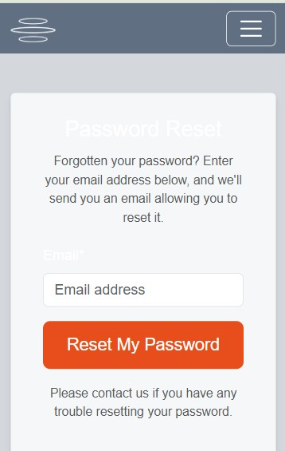
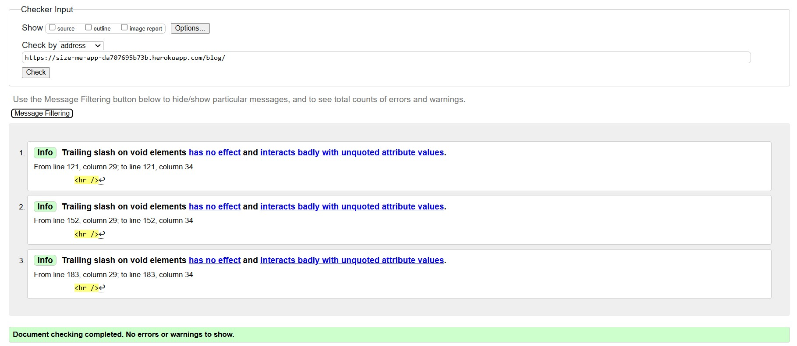
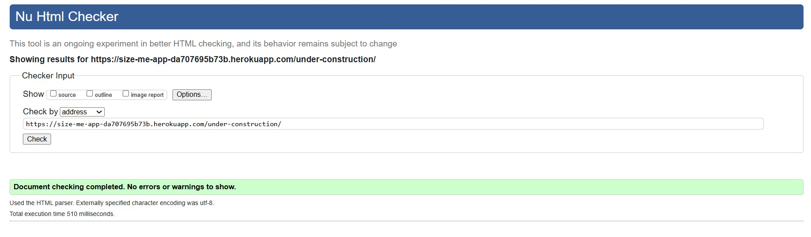
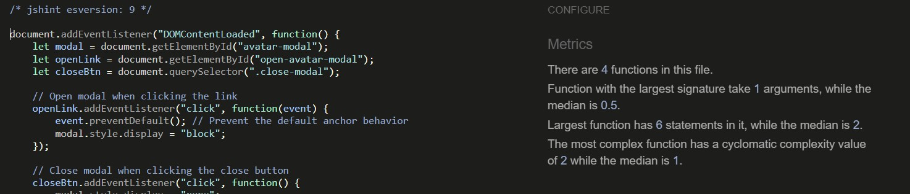
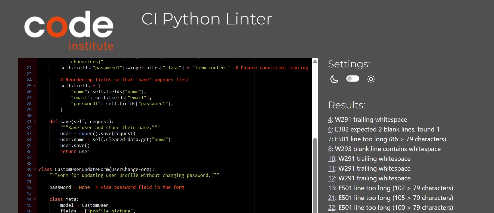

# TESTING
- [User Story Testing](#user-story-testing)
- [Lighthouse](#lighthouse)
- [Validation](#validation)

## User Story Testing

### User Story -  Store Personal Measurements.
As a registered user, I want to store my personal measurements,
so that I can easily use them when shopping online.

To ensure that users can securely enter, store, and use their measurements,
the following tests were conducted:

#### Browser used - Google Chrome, Safari, Samsung Internet
- Form Input Validation – Manually tested the measurement input form to ensure that all fields accept only valid numerical values and prevent empty submissions.
- Save & Retrieve Data – Entered measurements, saved them, and refreshed the page to verify persistence.
- Data Update & Deletion – Edited and deleted stored measurements, confirming that changes reflect correctly in the user dashboard.
- Mobile Compatibility – Ensured form usability and correct display on different screen sizes.
  
The feature successfully meets the user story criteria, allowing users to store, manage, and use their measurements efficiently and securely. 

 
 

### User Story - Simple and Secure Login Process.
As a user, I want a simple and secure login process,
so that I can access my stored measurements and comment on blog posts.

To ensure that the login system is both user-friendly and secure,
the following tests were conducted:

#### Browser used - Google Chrome, Safari, Samsung Internet
- Login Page Accessibility – Verified that the login page is easily accessible from the navigation menu and redirects correctly after authentication.
- Successful Login – Entered valid email and password combinations to confirm users can log in successfully.
- Failed Login Attempts – Tested incorrect credentials to ensure appropriate error messages are displayed.
- Password Reset Functionality – Verified that users can request a password reset, receive an email, and successfully reset their password.
- Session Management – Ensured users remain logged in across different pages and are logged out correctly when requested.
- Keyboard Navigation – Ensured that all form fields, buttons, and links are fully accessible via keyboard.
- User Feedback - Gathered informal feedback from testers to determine if the information provided was clear and sufficient for a smooth onboarding experience.

The feature successfully meets the user story criteria, providing users with a simple, secure, and accessible login experience. 

 
 

### User Story - Comment on Blog Posts.
As a registered user, I want to comment on blog posts,
so that I can share my thoughts and engage in discussions.

To ensure that the comment system is functional, user-friendly,
and secure, the following tests were conducted:

#### Browser used - Microsoft Edge, Google Chrome, Safari, Firefox, Samsung Internet
- Authentication Check – Verified that only registered users can post comments and that unauthenticated users are redirected to the login page.
- Comment Submission – Tested if users can successfully submit a comment and see it appear on the blog post.
- Username & Timestamp Display – Ensured that the commenter's username and the timestamp of the comment are correctly displayed.
- Edit Functionality – Edited a comment as the original author and confirmed the updates were saved and displayed correctly.
- Delete Functionality – Deleted a comment as the original author and verified it was removed from the post.
- Moderation & Approval – Checked that comments require approval and tested admin actions for approving or rejecting comments.
- User Authorization – Ensured that users can only edit or delete their own comments and not those of others.
  
The feature successfully meets the user story criteria, allowing users to comment, engage in discussions, and manage their own comments securely.

 
 

### User Story - Seamless Navigation Throughout the Site.
As a user, I want intuitive navigation across SizeMeApp,
so that I can easily find the features and information I need
without frustration.

To ensure the navigation system is user-friendly, accessible,
and visually responsive, the following tests were conducted:

#### Browser used - Microsoft Edge, Google Chrome, Safari, Samsung Internet
- Navigation Menu Visibility – Verified that the navigation bar appears on all pages, including - Dashboard, Blog, How It Works, and Contact.
- Sticky Header Implementation – Ensured the header remains fixed while scrolling for quick access.
- Navigation Link Accuracy – Clicked on each menu item to confirm that users are directed to the correct pages.
- Active Link Highlighting – Checked if the active page is visually distinguished (e.g., bold text, color change).
- Mobile-Friendly Hamburger Menu – Ensured the mobile menu opens and closes correctly, retaining accessibility features.
- User Flow Evaluation – Tested if users could intuitively navigate the site without confusion or unnecessary clicks.
- Hover Effects & Visual Feedback – Checked hover effects on icons and buttons, ensuring smooth transitions and proper animations.
- Speed & Responsiveness – Evaluated whether menu interactions (clicking, hovering) were quick and lag-free.
- Keyboard Navigation – Ensured users can navigate the menu using only the keyboard (Tab, Enter, Arrow keys).

The feature successfully meets the user story criteria, providing users with an intuitive, responsive, and accessible navigation experience throughout SizeMeApp.

 

## Lighthouse
I have recorded the first and final run with Lighthouse for all pages with images and warning messages below. I found since many of the pages are connected and have the same base.html and are connected to backend, some warnings appear that would probably not be present in a static website. 

### Home Page

#### First run with Lighthouse - Home page

Improvement messages: 
- Icon links do not have text for screen readers.
- Missing meta tag for description.
- Uses third-party cookies - 5 cookies found.
  
#### Second run with Lighthouse (Home page) - after fixing the issues.

### About Page

#### First run with Lighthouse - About page

Improvement messages: 
- Avoid large layout shifts 2 layout shifts found.
- Document does not have a meta description.
  
#### Second run with Lighthouse (About page) - after fixing the issues.

### Contact Page

#### First run with Lighthouse - Contact page

Improvement messages: 
- Background and foreground colors do not have a sufficient contrast ratio.
- Heading elements are not in a sequentially-descending order.
- Document does not have a meta description.
  
#### Second run with Lighthouse (Contact page) - after fixing the issues.

### Blog Page

#### First run with Lighthouse - Blog page

Improvement messages: 
- Properly size images.
- No CSP found in enforcement mode.
- Uses third-party cookies - 5 cookies found.
- No HSTS header found.
- Document does not have a meta description.
- Links do not have descriptive text - 3 links found.
  
#### Second run with Lighthouse (Blog page) - after fixing the issues.

### Sign Up Page

#### First run with Lighthouse - Sign Up page

Improvement messages: 
- Background and foreground colors do not have a sufficient contrast ratio.
- Heading elements are not in a sequentially-descending order.
- Document does not have a meta description.
  
#### Second run with Lighthouse (Sign Up page) - after fixing the issues.

### Login Page

#### First run with Lighthouse - Login page

Improvement messages: 
- Background and foreground colors do not have a sufficient contrast ratio.
- Document does not have a meta description
  
#### Second run with Lighthouse (Login page) - after fixing the issues.

### Dashboard Page

#### First run with Lighthouse - Dashboard page

Improvement messages: 
- Background and foreground colors do not have a sufficient contrast ratio.
- Uses third-party cookies - 5 cookies found.
- Enable text compression.
- Document does not have a meta description.
- Preconnect to required origins.
  
#### Second run with Lighthouse (Dashboard page) - after fixing the issues.

### Logout Page

#### First run with Lighthouse - Logout page

Improvement messages: 
- Eliminate render-blocking resources.
- Preconnect to required origins.
- Background and foreground colors do not have a sufficient contrast ratio.
- Uses third-party cookies - 5 cookies found.
- Document does not have a meta description.
  
#### Second run with Lighthouse (Logout page) - after fixing the issues.

## Validation

### W3C HTML Validator
I have included screenprints of the first and final validation of the HTML with W3C validation.
 

#### Home Page HTML- Initial Check

  
 
#### Home Page HTML- Final Check

  

#### About Page HTML- Initial Check

  
  
#### About Page HTML- Final Check

  

#### Contact Page HTML- Initial Check

  
  
#### Contact Page HTML- Final Check

  

#### Blog Page HTML- Initial Check

  
  
#### Blog Page HTML- Final Check

  

#### Signup Page HTML- Initial Check

  
  
#### Signup Page HTML- Final Check

  

#### Login Page HTML- Initial Check

  
  
#### Login Page HTML- Final Check

  

#### Dashboard Page HTML- Initial Check

  
  
#### Dashboard Page HTML- Final Check
I could not find the trailing slash in the code. I think it comes up due to the many layout shifts on this page. Since it does not disturb the functionality I left this comment.

  

#### Logout Page HTML- Initial Check

  
  
#### Logout Page HTML- Final Check

  

#### Under Construction Page HTML- Initial Check

  

### W3C CSS Validator
The CSS was succesfully validated for all pages.

### JSHint Validator
I have included screenprints of the first and final validation for each script validated with JSHint.

#### Avatar Script- Initial Check

  
#### Avatar Script- Final Check

  

#### Comments Script- Initial and Final Check

#### Dashboard Script- Initial and Final Check

#### Modal Script- Initial and Final Check

### CI Python Linter
The CI Python Linter helps ensure that our code is clean, maintainable, and error-free, improving the overall development workflow and reducing potential bugs before deployment.

It implements:
- Automatic Code Checks – The linter runs automatically when code is pushed to the repository.
- PEP 8 Compliance – Ensures that the code follows Python’s official style guide.
- Error & Warning Detection – Identifies syntax errors, unused imports, and other common issues.
- Consistent Formatting – Helps enforce standard formatting, reducing unnecessary code style variations.

Tools used:
- Flake8 – Checks for syntax errors, style violations, and undefined variables.
- Black – Automatically formats code to follow best practices.
- Pylint – Provides detailed code analysis and improvement suggestions.

I ran all my Python code through the Python Linter with the following results. The final check for all code files were without errors. For more images tested on all apps see the [Read Me Images](assets/images_readme) folder.

### Accounts App
#### Accounts forms.py- Initial Check

#### Accounts forms.py- Final Check

#### Accounts admin.py- Initial Check

#### Accounts admin.py- Final Check

#### Accounts apps.py- Initial Check

#### Accounts apps.py- Final Check

#### Accounts models.py- Initial Check

#### Accounts models.py- Final Check

#### Accounts signals.py- Initial Check

#### Accounts signals.py- Final Check

